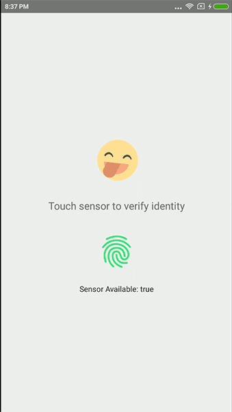

# react-native-fingerprint-identify

Fingerprint android auth for react-native (Android only).

This is an expandable Android fingerprint API compatible lib, which also combines [Samsung](http://developer.samsung.com/galaxy/pass#) and [MeiZu](http://open-wiki.flyme.cn/index.php?title=%E6%8C%87%E7%BA%B9%E8%AF%86%E5%88%ABAPI)'s official Fingerprint API.

Samsung and MeiZu's fingerprint SDK supports most devices which system versions less than Android 6.0.

Api priority level：Android > Samsung > MeiZu, Xiaomi,...

# Demo





# Getting started

`$ npm install react-native-fingerprint-identify --save`


## Most automatic installation

`$ react-native link react-native-fingerprint-identify`

##### Make sure the following lines in `android/app/build.gradle`:
```
android {
    compileSdkVersion 25
    buildToolsVersion "25.0.2"
...
    defaultConfig {
      targetSdkVersion 25

```

## Manual Installation

##### Open up `android/app/src/main/java/[...]/MainApplication.java`


  + Add `import com.fingerprint.identify.RNFingerprintIdentifyPackage;`

    to the imports at the top of the file


  + Add `new RNFingerprintIdentifyPackage()`

    to the list returned by the `getPackages()` method

##### Append the following lines to `android/settings.gradle`:
```  	
  	include ':react-native-fingerprint-identify'
  	project(':react-native-fingerprint-identify').projectDir = new File(rootProject.projectDir, '../node_modules/react-native-fingerprint-identify/android')
```

##### Make sure the following lines in `android/app/build.gradle`:
```
android {
    compileSdkVersion 25
    buildToolsVersion "25.0.2"
...
    defaultConfig {
      targetSdkVersion 25

```

##### Insert the following lines inside the dependencies block in `android/app/build.gradle`

in dependencies block
```
  compile project(':react-native-fingerprint-identify')
```  	

# Example

Please clone repo and look on the example project to get more details

```javascript
import FingerprintIdentify from 'react-native-fingerprint-identify';

scanFingerprint = async () => {
  try {
    const initFingerPrintIdentify = await FingerprintIdentify.initFingerPrintIdentify()
    const isSensorAvailable = await FingerprintIdentify.isSensorAvailable()
    if (initFingerPrintIdentify && isSensorAvailable) {
      await FingerprintIdentify.startIdentify((status) => {
        console.log(status)
      })
    }
  } catch (error) {
    console.log(error)
    return
  }
}

```

# Usage

### Easy custom error message with error codes. ###

## Errors on startIdentify() function:
```
ERROR_NOT_AVAILABLE
ERROR_NOT_MATCH
ERROR_NOT_MATCH_AND_CHANCES_LEFT:(AvailableTimes)
```

## Errors on isSensorAvailable() function:
```
ERROR_HARDWARE: The device does not support fingerprint scanning.
ERROR_ENROLLED: No fingerprints registered.
ERROR_PERMISSION: App has no permission.
ERROR_INITIALIZED: The FingerPrintIdentify can not initialize
```


### Init FingerprintIdentify before request scan. ###
```
FingerprintIdentify.initFingerPrintIdentify()
```


### Promise returns true if success and string error in other cases (including case when you have sensor, but not enabled it in your phone's settings) ###
```
FingerprintIdentify.isSensorAvailable()
```


### Starting scan finger print and get the result in the callback function, returns true if success and string error in other cases. ###
```
FingerprintIdentify.startIdentify((val) => console.log(val))
```


### Removing event listener (fingerprint identity status) - prevent crash App after authentication, usually put in componentWillUnmount() ###
```
FingerprintIdentify.dismiss()
```


### Removing event listener to scan fingerprint and also cancel identify ###
```
FingerprintIdentify.cancelIdentify()
```

# Troubleshooting

If you make five wrong fingerprint attempts, Android Fingerprint API requires some time to continue work on the sensor.

In that case `FingerprintIdentify.startIdentify()` locked out, so it would be good to make the user aware that sensor is temporarily unavailable (near 30 seconds).


# Questions or suggestions?

Feel free to [open an issue](https://github.com/williamtran29/react-native-fingerprint-identify/issues)

# Donation
If this project help you reduce time to develop, you can give me a cup of coffee :)

[](https://www.paypal.com/cgi-bin/webscr?cmd=_s-xclick&hosted_button_id=5A4DTX8DE85VN)
